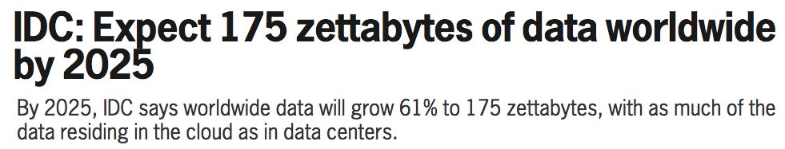
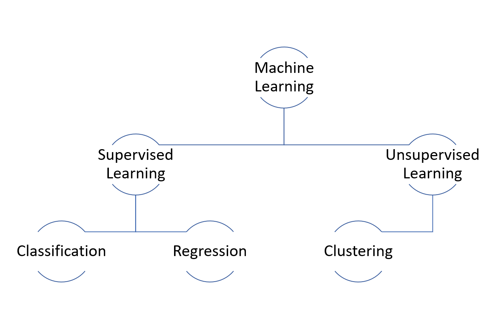
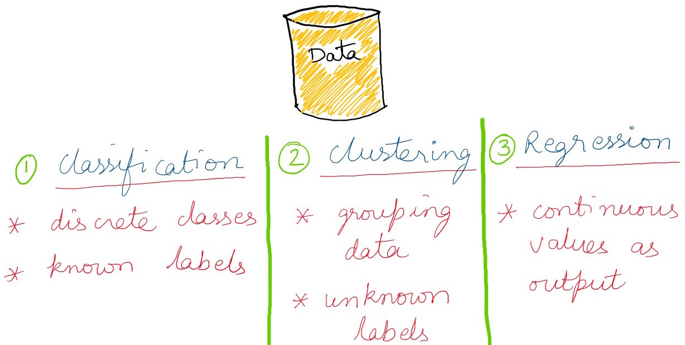

layout: true
  
<div class="my-footer">

</div>

---

```{r xaringan-themer, include = FALSE}
library(xaringanthemer)
mono_light(
  base_color = "midnightblue",
  header_font_google = google_font("Josefin Sans"),
  text_font_google   = google_font("Montserrat", "500", "500i"),
  code_font_google   = google_font("Droid Mono"),
  link_color = "#8B1A1A", #firebrick4, "deepskyblue1"
  text_font_size = "28px"
)
```

## The Premise

- Data Growth

.left[]
.right[]

---

## The Core

- Co-evolution

.center[]

---

## Strategies

.center[]


---

## Strategies (Contd.)

.center[]

---


## Resources

- Blog: [https://shauryajauhari.github.io/](https://shauryajauhari.github.io/)

- GitHub repo: [https://github.com/shauryajauhari](https://github.com/shauryajauhari)

.center[Get in touch on Twitter [@shauryajauhari](https://twitter.com/shauryajauhari) <br> or by e-mail `shauryajauhari at gzhmu dot edu dot cn`]

