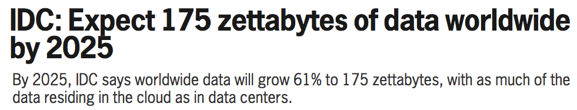

Machine Learning With Galaxy
========================================================
author: Shaurya Jauhari, Mora Lab, GMU. (Email: shauryajauhari@gzhmu.edu.cn)
date: 2020-08-07 16:19:45
autosize: true

The Premise
========================================================
- Data Growth

The Core
========================================================
- Co-evolution

Strategies
========================================================

Strategies (Contd.)
========================================================

Classification
========================================================

- Supervised Learning

- Logistic Regression, K-Nearest Neighbor, Support Vector Machines

- Ensemble Classifiers
  - Random Forests

- [https://shauryajauhari.github.io/classification_in_machine_learning/](https://shauryajauhari.github.io/classification_in_machine_learning/)

Clustering
========================================================

- Unsupervised Learning

- Hierarchical Clustering, K-means, DBSCAN

- [https://shauryajauhari.github.io/clustering_in_machine_learning/](https://shauryajauhari.github.io/clustering_in_machine_learning/)

Regression
========================================================

- Linear Regression
  - RMSE, R2 parameters

- Workflow
  - Train
  - Test
  - Visualize

- [https://shauryajauhari.github.io/regression_in_machine_learning/](https://shauryajauhari.github.io/regression_in_machine_learning/)

Resources
========================================================

- Blog: [https://shauryajauhari.github.io/](https://shauryajauhari.github.io/)

- GitHub repo: [https://github.com/shauryajauhari](https://github.com/shauryajauhari)

- Get in touch on Twitter [@shauryajauhari](https://twitter.com/shauryajauhari)   or by e-mail: `shauryajauhari at gzhmu dot edu dot cn`

